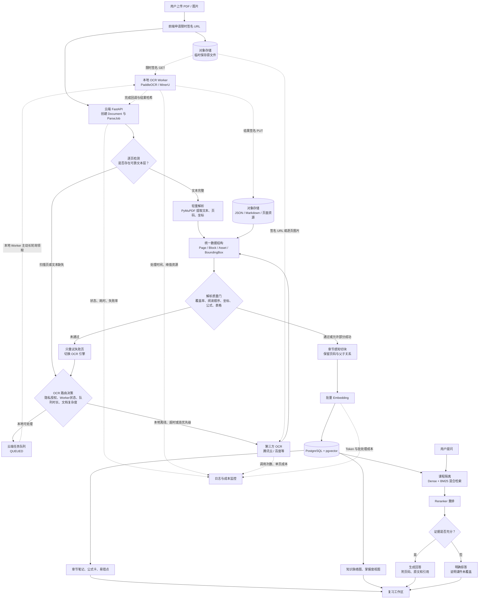

# 期末复习智能体项目方案

> 文档状态：想法收敛与技术预研阶段
> 最后更新：2026-07-18
> 目标：记录当前已经形成的产品、架构、部署、成本和验证思路，作为后续 PRD、技术设计与实现工作的共同基线。

## 1. 项目定位

本项目面向大学生期末复习场景。用户上传课程 PDF、课件截图或照片后，系统将资料解析为可检索的课程知识库，并提供有课件出处的问答、复习笔记、练习题、错题跟踪和知识脉络可视化。

项目不应只做成“上传 PDF 后聊天”的 NotebookLM 简化版，而应形成以下复习闭环：

1. 上传并整理课程资料。
2. 建立章节、概念、公式、例题和知识依赖结构。
3. 根据考试范围、考试日期、题型和可用时间诊断复习优先级。
4. 通过主动回忆、练习和即时反馈发现薄弱点。
5. 将错题和低掌握知识点重新加入复习队列。
6. 通过笔记、知识图和模拟测试完成考前巩固。

一句话定位：

> 基于课程资料证据，帮助学生完成诊断、复习、练习和查漏补缺的期末学习助手。

## 2. 核心原则

### 2.1 有证据地回答

RAG 不能绝对保证模型永不出错，因此系统目标不是宣称“零幻觉”，而是建立可验证的回答边界：

- 默认启用“仅基于课件”模式。
- 核心结论必须附带文档名、页码或幻灯片编号和原文片段。
- 证据不足时明确说明“当前课件中没有足够依据”。
- 将课件原意、模型解释和外部补充明确分层。
- 通过引用覆盖率和引用一致性检查降低无依据回答。
- 在数据库查询层按 `user_id`、`course_id` 和 `document_id` 隔离，不能只依赖提示词。

### 2.2 学习闭环优先于功能堆叠

笔记、知识图和练习必须服务于复习决策，而不是成为装饰性功能。系统应帮助用户回答：

- 当前最应该复习什么？
- 哪些知识点是后续内容的前置基础？
- 哪些内容看过但没有真正掌握？
- 错误来自概念、计算、步骤、混淆还是审题？
- 回答和笔记的依据位于课件哪一页？

### 2.3 确定性工作流优先

第一版不强行引入复杂多智能体框架。上传解析、检索问答、笔记生成和练习生成适合采用可观测、可测试的确定性工作流。

后续真正需要 Agent 的位置包括：

- 根据问题类型选择检索、图表理解、笔记或出题工具。
- 根据考试时间、薄弱点和遗忘风险动态调整复习计划。
- 根据错题原因选择讲解、基础题、变式题或跨章节综合题。

## 3. 总体流程图



## 4. 文档解析与 OCR 策略

### 4.1 分层处理

系统不应对所有 PDF 无差别执行 OCR：

1. 原生文字 PDF：使用 PyMuPDF 提取文字、页码和坐标，API 成本为零。
2. 扫描 PDF 或课件照片：进入 OCR 路由。
3. 普通中文印刷体：优先测试 PaddleOCR。
4. 公式、表格和复杂版面：优先测试 MinerU 或文档解析服务。
5. 流程图和示意图：先生成可检索描述；问题命中后，再把原始页面裁剪交给多模态模型。

### 4.2 OCR Router 输入

OCR Router 后续可根据以下数据选择本地或第三方服务：

- 页面是否包含文本层。
- 页面清晰度和倾斜程度。
- 是否包含公式、表格、双栏或复杂图文混排。
- 用户是否授权文件在本地设备处理或发送给第三方。
- 本地 Worker 是否在线。
- 当前队列长度和预计等待时间。
- 用户是否选择高优先级处理。
- 各引擎的历史质量、耗时和单页成本。

第一版可以采用规则路由，积累数据后再调整为基于评分的路由。

## 5. 本地 Pull Worker

### 5.1 推荐原因

本地电脑位于 NAT 或家庭路由器后面时，不适合直接暴露公网上传接口。推荐让本地 Worker 主动通过 HTTPS 向云端领取任务，因此无需公网 IP、端口转发、Cloudflare Tunnel 或 frp。

### 5.2 工作方式

1. 用户通过签名 URL 将原文件直接上传到对象存储。
2. 云端创建 `OCR_JOB`。
3. 本地 Worker 长轮询领取任务。
4. 云端返回任务租约以及限时签名 GET/PUT URL。
5. Worker 下载文件并校验 SHA-256。
6. Worker 在受限环境内逐页解析，并保存页级检查点。
7. Worker 上传结构化结果并提交完成回调。
8. 云端以事务方式将任务更新为 `READY`，再触发切块和 Embedding。
9. 本地临时文件在任务完成后立即清理。

### 5.3 任务状态

```text
UPLOADED -> QUEUED -> OCR_PROCESSING -> INDEXING -> READY
                         |                 |
                         v                 v
                      RETRYING       PARTIAL_FAILED
                         |
                         v
                    DEAD_LETTER
```

### 5.4 可靠性要求

- 使用任务租约和心跳，Worker 失联后任务自动回到队列。
- 使用 `document_id + file_hash + ocr_engine_version` 保证幂等。
- 结果路径包含 OCR 引擎版本，便于重跑和效果比较。
- 只重试失败页面，避免整份文档重复处理。
- Worker 只能执行固定解析任务，不能执行云端下发的任意命令。
- Worker 凭证不能列出整个存储桶，只能领取任务和访问当前签名 URL。

## 6. RAG 检索与回答链路

推荐链路：

```text
用户问题
-> 课程与权限过滤
-> 查询改写
-> Dense 向量召回 + BM25 关键词召回
-> RRF 融合
-> Reranker 将 Top 20 重排为 Top 5-8
-> 去重与父子上下文组装
-> 严格基于证据生成
-> 引用覆盖和一致性检查
-> 带页码回答或拒答
```

切块应保留以下元数据：

- `user_id`
- `course_id`
- `document_id`
- `page_number` 或 `slide_number`
- `chapter_path`
- `block_type`
- `bounding_box`
- `parent_chunk_id`
- `source_asset_id`

固定 Token 切块只作为基线。正式方案应优先使用章节、标题、页面版面和父子关系感知的结构化切块，避免拆开定义、表格、公式和完整例题。

## 7. 笔记、练习与可视化

### 7.1 笔记

- 按章节分层生成，避免一次处理整门课程。
- 包含章节摘要、核心概念、公式、例题、易错点和考前一页纸。
- 每条重要结论关联原始 Chunk 和页码。
- 区分课件内容、模型解释和外部补充。
- 支持编辑、版本记录、重新生成和 Markdown/PDF 导出。
- 可将笔记一键转换为隐藏答案的主动回忆题。
- 错题结果可以反向更新笔记中的易错点。

### 7.2 练习闭环

```text
短测诊断
-> 学生先作答并填写信心程度
-> 系统按课件证据反馈
-> 生成相似题或变式题
-> 记录错因与掌握度
-> 加入后续复习队列
```

### 7.3 可视化

优先实现：

1. 可编辑的章节树。
2. 带课件出处的概念依赖图。
3. 叠加考试权重和掌握度的薄弱点热力图。
4. 错题类型与遗忘趋势。

知识图中的边必须区分“课件明确陈述”和“模型推断”。第一版不需要图数据库，可以先用 PostgreSQL 保存节点、关系和证据，再使用 React Flow 或 ECharts 展示。

## 8. 2 核 2G 云服务器部署方案

2 核 2G 服务器可以作为应用编排服务器，但不适合作为 LLM、VLM、BGE-M3、MinerU 等重模型的本地推理服务器。

### 8.1 已确认的服务器条件

- 供应商：阿里云轻量应用服务器。
- 地域：泰国（曼谷）。
- 规格：2 vCPU、2 GiB 内存、40 GiB ESSD 云盘。
- 当前镜像：OpenClaw 2026.2.9。
- 当前到期时间：2027-02-24。

当前镜像可能已经运行 OpenClaw 相关服务。正式部署前必须检查其常驻内存、监听端口、反向代理和开机服务。如果 OpenClaw 不再使用，推荐先创建快照，再更换为干净的 Ubuntu LTS 最小化镜像；如果仍需使用，不建议让它与本项目长期共享同一台 2 GiB 服务器。

服务器凭据不得写入本文档、代码、Git、命令历史或 `.env` 示例。部署前应使用 SSH 密钥和普通部署用户，确认密钥登录可用后关闭 root 密码登录，并在安全组中只公开 80/443，SSH 端口限制来源，PostgreSQL 不对公网开放。

推荐部署：

```text
Nginx
-> 静态前端
-> FastAPI 单 Worker
-> PostgreSQL + pgvector
-> PostgreSQL 任务表
-> 对象存储
-> 外部 Embedding / LLM API

本地电脑
-> PaddleOCR / MinerU Pull Worker

第三方服务
-> 预留 OCR 降级接口，当前阶段不启用付费调用
```

资源约束：

- 前端静态构建后由 Nginx 托管，避免常驻 Next.js SSR。
- FastAPI 先运行一个 Uvicorn Worker。
- PDF/OCR 任务并发设为 1。
- 初期使用 PostgreSQL 任务表，暂不强制部署 Redis/Celery。
- 设置上传文件大小、页数、渲染 DPI 和处理时间上限。
- 增加 2-4 GB Swap 防止偶发 OOM，但不能依赖 Swap 提升性能。
- 原文件、页面裁剪和 OCR 结果放对象存储，不长期占用服务器磁盘。
- 记录内存、CPU、队列等待时间和 P95 响应时间，达到阈值后再拆分 Worker 或数据库。
- 对象存储默认选择阿里云 OSS，优先选择与服务器相同或网络最接近的地域，并在开通前比较跨地域流量价格和本地 Worker 下载延迟。

## 9. 初步技术选型

| 层级 | MVP 候选 | 说明 |
|---|---|---|
| 前端 | Next.js/React 静态构建 | PDF.js 原文定位，React Flow/ECharts 可视化 |
| API | FastAPI | 异步 I/O、流式回答和任务管理 |
| 业务数据库 | PostgreSQL | 用户、课程、文档、任务、笔记、练习记录 |
| 向量检索 | pgvector | 数据量较小时降低部署复杂度 |
| 文件存储 | 阿里云 OSS | 使用限时签名 URL 直传和下载；临时页面 24 小时、登录用户资料 30 天、访客资料 24 小时 |
| 原生 PDF | PyMuPDF | 文本、坐标和页面级信息提取 |
| 本地 OCR | PaddleOCR | 中文印刷体基线 |
| 复杂文档解析 | MinerU | 重点测试公式、表格和复杂版面 |
| Embedding | API 优先；BGE-M3 作为评测候选 | 2G 服务器不本地加载模型 |
| Reranker | 云 API 或独立服务 | 通过消融实验评估收益和延迟 |
| 生成模型 | 统一 Model Adapter | 避免业务逻辑绑定单一供应商 |
| 可观测性 | 结构化日志，后续接 Langfuse/OpenTelemetry | 记录 Trace、证据、Token、耗时和费用 |

## 10. 第三方 OCR 价格快照

以下为 2026-07-18 核对的官方公开刊例价。价格和活动可能变化，开发时应再次核对。通常一张扫描页约等于一次调用；原生文字 PDF 不需要 OCR。

| 服务 | 免费额度 | 主要公开价格 | 当前判断 |
|---|---:|---:|---|
| 腾讯云通用 OCR | 共享 1000 次/月 | 1000 次 120 元；1 万次 800 元 | 免费额度适合低量 MVP |
| 腾讯多模态文档解析 | 首次 1000 页，有效期 1 年 | 1000 页 70 元；1 万页 600 元 | 可用于复杂文档效果对比 |
| 阿里云基础 OCR | 200 次/月 | 首个 1 万次阶梯为 0.0825 元/次 | 无需预购，按量较灵活 |
| 百度标准 OCR | 公开价格页未展示统一免费额度 | 1 万次 50 元，即 0.005 元/次 | 大批量纯文本刊例价低 |
| 百度标准含位置版 | 同上 | 1 万次 100 元，即 0.01 元/次 | 更适合需要原文坐标的 RAG |
| 百度办公文档识别 | 同上 | 1 万次 1500 元，即 0.15 元/次 | 结构能力更强但价格较高 |

官方来源：

- [腾讯云 OCR 计费概述](https://cloud.tencent.com/document/product/866/17619)
- [阿里云 OCR 按量付费](https://help.aliyun.com/zh/ocr/product-overview/pay-as-you-go)
- [阿里云 OCR 免费额度](https://help.aliyun.com/zh/ocr/product-overview/free-quota)
- [百度智能云 OCR 价格](https://cloud.baidu.com/product-price/ocr.html)

注意：资源包折算单价只有在额度得到充分使用时才成立。例如购买百度 1 万次含位置版需要先支付 100 元，即使只处理 100 页，实际现金支出仍为 100 元。

## 11. 推荐的成本路由

当前 OCR 验证阶段采用零 API 预算策略：

1. 原生文字 PDF 使用 PyMuPDF，OCR 成本为零。
2. 原生 PPTX 使用 OOXML/python-pptx 提取文字、表格和结构，整页渲染只用于补充视觉信息。
3. 普通扫描页和照片进入本地 PaddleOCR Worker。
4. 公式、表格和复杂版面页面升级到本地 MinerU。
5. 本地 Worker 离线或处理失败时保留任务并显示状态，不自动发送第三方 OCR。

代码仍应保留第三方 OCR Adapter 和页级降级接口，但默认关闭。只有在本地基准测试完成、用户明确授权并重新确定预算后，才考虑启用腾讯云免费额度或百度含位置版。公式、表格和图文混排场景不能只比较字符识别单价，还要把人工修正时间纳入成本。

## 12. MVP 范围

### 阶段一：可信资料问答

- 单课程工作区。
- PDF、PPTX 和图片上传。
- 解析进度、失败页和重新处理。
- 原生 PDF、原生 PPTX 与本地 OCR 路由。
- 章节感知切块、混合检索和 Reranker。
- 带页码和原文预览的问答。
- 无证据问题拒答。

### 阶段二：复习闭环

- 章节笔记和考前一页纸。
- 诊断测验和课件来源标注。
- 错题本、错因分类和掌握度。
- 章节树、概念依赖图和薄弱点视图。
- 根据考试日期与可用时间生成复习计划。

### 阶段三：评测与工程化

- OCR 和 RAG 离线评测集。
- 调用链、成本和性能观测。
- Docker 化和 CI。
- 上传限流、任务重试、删除知识库和多用户隔离。
- 小规模学生测试和结果报告。

暂缓范围：

- 复杂多智能体框架。
- 图数据库。
- 多人协作和教师端。
- 大量联网知识补充。
- 复杂动画、3D 可视化和游戏化排行。
- 在 2 核 2G 服务器上本地运行大模型。

### 四周核心 MVP 节奏

该时间表是范围控制，不是硬截止日期：

```text
第 1 周：清理测试集、建立 Manifest、完成 PyMuPDF/PPTX/PaddleOCR/MinerU 基准
第 2 周：文档标准化、结构化切块、Embedding、混合检索和引用数据模型
第 3 周：问答、拒答、原文定位、章节笔记和基础前端
第 4 周：离线评测、成本与性能日志、服务器部署、安全限制和演示录屏
```

轻量错题本、掌握度视图和更完整的学习计划在核心 MVP 验收后继续实现，不为赶四周进度压缩引用可靠性和评测工作。

## 13. 评测方案

### 13.1 OCR 选型实验

准备 30-50 页代表性资料，覆盖：

- 原生文字 PDF。
- 清晰和模糊的中文扫描页。
- 课件照片、倾斜和阴影。
- 单栏、双栏和图文混排。
- 表格、数学公式、流程图和代码。

对 PyMuPDF、PaddleOCR、MinerU、腾讯云和百度含位置版使用同一批输入，比较：

- 文本覆盖率和字符错误率。
- 阅读顺序正确率。
- 页码和坐标准确率。
- 表格结构保留率。
- 公式识别准确率。
- 100 页处理时间。
- 峰值内存和 CPU 使用。
- 100 页实际现金成本。
- 人工修正所需时间。

最终根据实测数据确定 OCR Router 的规则和降级阈值。

### 13.2 RAG 评测

建议准备 3-5 门课程、至少 200 道人工标注问题，其中约 20% 为课件无法回答的问题，并标注正确答案和证据页。

核心指标：

- 检索：Recall@5、MRR、nDCG。
- 回答：正确性、Groundedness、Faithfulness。
- 引用：引用准确率、引用覆盖率和页码准确率。
- 拒答：无答案问题识别 Precision、Recall、F1。
- 系统：索引成功率、P50/P95 延迟、错误率和单次查询成本。

必要的消融实验：

- 固定切块与结构化切块。
- 纯向量检索与 Dense + BM25 混合检索。
- 有无 Reranker。
- 有无引用一致性检查。
- 仅文本解析与图表/VLM 增强解析。

### 13.3 用户效果验证

找 10-20 名近期有考试的学生进行小规模测试，关注：

- 前测到后测的成绩变化。
- 完成同一复习任务所需时间。
- 48 小时或 7 天后的知识保持率。
- 错题再次作答正确率。
- 学生信心与真实正确率之间的差距。

## 14. 安全、隐私与版权

- 明确告知用户课件可能在本地 Worker 或第三方 OCR 处理，并取得授权。
- 原文件与本地临时文件设置明确保留期限，支持用户删除和索引级联删除。
- 所有下载和上传使用 HTTPS 与短期签名 URL。
- 对象存储开启服务端加密，本地磁盘启用加密。
- 将上传文件视为不可信输入，在受限容器或沙箱内解析。
- 限制文件类型、文件大小、页数、解压体积、DPI、CPU 时间和内存。
- 文档内容只能作为数据，不能覆盖系统指令，防范课件中的 Prompt Injection。
- 禁止解析 PDF 宏、附件或执行文件中的任何代码。
- 默认不将用户课件用于模型训练。

## 15. 求职作品应体现的能力

项目对大模型应用开发岗位的价值不在于罗列框架，而在于展示：

- 真实复杂文档的摄取、OCR、版面和多模态处理能力。
- 可复现的 RAG 评测集、基线和消融实验。
- 引用、拒答、用户隔离和 Prompt Injection 防护。
- 异步任务、租约、幂等、失败恢复和增量索引。
- 2 核 2G 资源约束下的成本路由与扩容设计。
- 在线 Demo、真实用户、性能数据和成本数据。
- 对失败方案、技术取舍和改进过程的清晰说明。

后续 README 和演示应包含架构图、快速启动、样例课件、评测脚本、实验结果、典型失败案例、API 文档和 5 分钟完整演示流程。

## 16. 决策台账

| 问题 | 当前结论 | 状态 |
|---|---|---|
| 首测课程 | 使用 `<local-course-materials>`，但通过 Manifest 区分 RAG 语料、OCR 样本、测试题和参考答案，排除无关课程资料、重复文件和生成内容 | 已决定 |
| 本地算力 | MacBook Air M1、16 GiB；Worker 并发固定为 1，PyMuPDF/PPTX 原生解析优先，PaddleOCR 处理普通扫描，MinerU 只处理复杂页 | 已决定 |
| 云服务器 | 阿里云轻量应用服务器，泰国（曼谷），2 vCPU/2 GiB/40 GiB | 已决定 |
| 对象存储 | 默认阿里云 OSS；登录用户资料 30 天、访客 24 小时、临时页面 24 小时，本地临时文件任务完成即删除 | 暂定，开通前核对地域与流量价格 |
| 本地 Worker | 按需在线、并发 1、30 秒心跳、90 秒判定离线、10 分钟任务租约；当前不承担 24 小时 SLA | 已决定 |
| OCR 预算 | 当前为 0，只测试 PyMuPDF、PPTX 原生解析、PaddleOCR 和 MinerU；第三方 OCR Adapter 保留但关闭 | 已决定 |
| OCR 最终路由 | 先完成代表性样本基准，再根据质量、RAG 引用可用性、耗时、内存和维护成本确定阈值 | 待实验 |
| Embedding、Reranker、生成模型 | OCR 阶段不采购；进入 RAG 阶段后单独评测和确定预算，业务层必须使用 Model Adapter | 后续决定 |
| 功能顺序 | 先完成可信问答、引用、拒答和章节笔记，再增加轻量错题闭环和知识图 | 已决定 |
| 隐私授权 | 明确区分项目方自托管解析节点与第三方云服务；当前资料只用于内部评测，公开 Demo 使用脱敏、自制或开放许可资料 | 原则已决定，文案待写 |
| 开发周期 | 以四周完成核心 MVP 为参考，不设置牺牲质量的硬截止日期 | 已决定 |
| 公开 Demo | 预置脱敏课程允许匿名体验，真实上传使用邀请码和配额，并准备录屏 | 暂定 |

下一轮真正需要通过工作或实验解决的问题：

1. 当前 OpenClaw 镜像是否继续使用；若不使用，则在快照后切换干净系统镜像。
2. 建立课程资料 Manifest、去重结果和 OCR 人工金标准。
3. 完成本地解析器基准，确定 MinerU 的触发条件和质量门。
4. 进入 RAG 阶段后确定 Embedding、Reranker 和生成模型供应商及预算。
5. 部署前确定域名、HTTPS 和中国大陆用户访问泰国节点的实际延迟。

这些问题应以小规模实验和明确指标决定，而不是仅凭框架热度或单次 API 标价决定。
