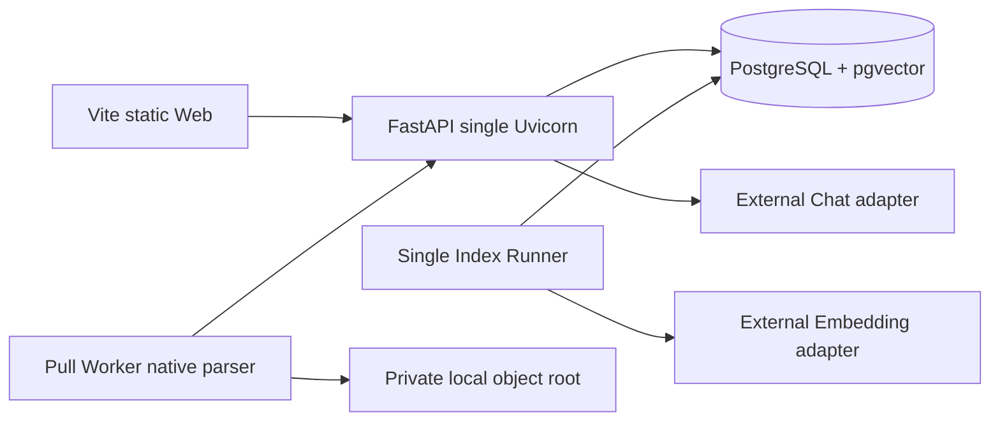

# 架构与本地运行边界

## 进程拓扑

Compose 只负责 PostgreSQL/pgvector；API、Runner、Worker 和 Web 在本地 RC 脚本中作为 loopback 宿主进程启动。这样可以避免为当前求职演示范围引入未验证的镜像、容器内 Secret 和额外常驻内存。

## 数据事实与派生物

- PostgreSQL 保存用户、课程、文档、不可变 Revision、Job、索引 manifest、Evidence 依赖和审计状态。
- 本地对象根保存原文件与解析产物；对象 key 不进入公开报告。
- Chunk Embedding 使用通用 `vector`，由模型 ID 与维度联合约束。当前使用精确 pgvector 查询，不创建 HNSW/IVFFlat。
- BM25S 索引使用 Jieba 分词，以 manifest、词典哈希和文档集合哈希标识，通过临时目录完成后原子重命名，并以 PostgreSQL active pointer 为准。
- 新 Revision 只有在 Dense 与 Lexical 都完整时，才在同一数据库事务中切换文档 Revision 和课程 Lexical manifest。失败保留旧 active。

## Provider 边界

运行时 registry 只构造真实配置 Adapter。未配置 Embedding 时，IndexJob 进入 `index_blocked_provider` 并可在配置恢复后显式 resume；未配置 Chat 时，问答明确不可用。测试 double 只存在于测试依赖注入和标记为 `test-double` 的离线报告，不进入 runtime registry。

## Worker 与 OCR

默认 Worker 包含原生 PDF、Markdown 解析，并保留历史 PPTX 记录的解析兼容；新上传不接受 PPT/PPTX。Paddle 位于独立 profile，capability probe 不下载或初始化模型；操作员必须对每个后端显式 `warmup`，并在真实自制页通过严格 Adapter 后写入独立 readiness marker。缺少包、平台、cache 或 marker 时 fail closed。General OCR 成功不代表 PP-StructureV3、MinerU 或付费 OCR 可用。私有 OCR 输入只在本机授权 smoke 中处理，原文件不复制到仓库，聚合报告不保留原文或源路径。

## 删除和授权

所有业务查询由可信 Principal 加 course/document scope 构造。删除先逻辑失效并递增 epoch，随后清理对象、Revision、Chunk、Embedding、BM25、答案和笔记依赖。Citation 必须匹配本次授权 Evidence、活动 Revision、内容哈希和来源位置。

## 资源基线

本地基线是静态 Web、单 Uvicorn、小 PostgreSQL 连接配置、单 Index Runner、精确向量和 BM25 mmap。`2 GiB` 报告是等效本地 preflight，固定写入 `local_equivalent_only=true` 与 `production_capacity_verified=false`。它不能代替真实服务器、网络、备份、TLS、生产认证或长期负载验证。

当前架构只描述本地可验证边界，不构成生产就绪声明。生产认证、入口代理、隔离、容量、部署、回滚和观测仍需在目标环境中单独设计与验证。
